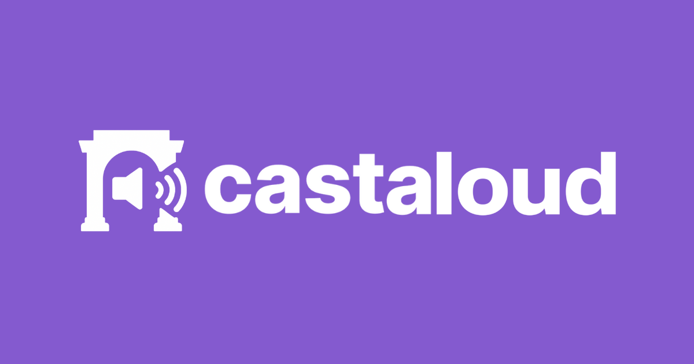

# Cast Aloud

A cutting-edge accessibility application that transforms Farcaster social media interaction through intelligent voice technologies and inclusive communication tools.



## Features

### Core Accessibility Tools
- **Text-to-Speech**: Read Farcaster casts aloud with real-time word highlighting
- **Voice Replies**: Record voice responses that are automatically transcribed and polished with AI
- **Speed Control**: Adjust playback speed in real-time while maintaining UI state
- **Voice Selection**: Choose from browser voices or premium OpenAI TTS voices

### Farcaster Integration
- **Frame Protocol**: Fully compliant with Farcaster Frame specification
- **Embed Detection**: Automatically detects when running as a cast embed
- **Compact UI**: Shows branded player interface when embedded in Farcaster
- **Cast Extraction**: Paste Farcaster URLs to automatically extract cast content

### AI-Powered Features
- **Speech Transcription**: OpenAI Whisper integration for accurate voice-to-text
- **Reply Polishing**: GPT-4o enhancement of user replies for better engagement
- **Feedback Generation**: AI analysis and suggestions for reply improvements

## Tech Stack

### Frontend
- **React 18** with TypeScript
- **Vite** for fast development and optimized builds
- **Wouter** for lightweight client-side routing
- **TanStack Query** for server state management
- **Shadcn/ui** with Radix UI primitives
- **Tailwind CSS** with custom Farcaster brand colors

### Backend
- **Node.js** with TypeScript
- **Express.js** for API endpoints
- **Multer** for audio file handling
- **OpenAI API** for Whisper transcription and GPT-4o text generation

### Database & Storage
- **Drizzle ORM** with PostgreSQL support
- **In-memory storage** for development
- **Database interface** ready for production scaling

## Getting Started

### Prerequisites
- Node.js 20 or higher
- PostgreSQL 16 (for production)
- OpenAI API key (for voice features)

### Installation

1. Clone the repository:
```bash
git clone https://github.com/YOUR_USERNAME/cast-aloud.git
cd cast-aloud
```

2. Install dependencies:
```bash
npm install
```

3. Set up environment variables:
```bash
# Copy the example environment file
cp .env.example .env

# Add your API keys
OPENAI_API_KEY=your_openai_api_key_here
DATABASE_URL=your_database_url_here
```

4. Start the development server:
```bash
npm run dev
```

The application will be available at `http://localhost:5000`

## Usage

### Reading Casts Aloud
1. Paste a Farcaster post URL or enter text directly
2. Click "Read Aloud" to hear the content with word highlighting
3. Adjust voice settings and playback speed as needed

### Voice Replies
1. Click the microphone button to start recording
2. Speak your reply naturally
3. Review the AI-transcribed text
4. Use "Polish Reply" to improve the response with AI
5. Copy the final reply to post on Farcaster

### Embed Usage
When embedded in Farcaster casts, Cast Aloud automatically:
- Detects the embed context
- Loads the cast content
- Shows a compact player interface
- Provides immediate playback functionality

## API Endpoints

### Audio Processing
- `POST /api/transcribe-audio` - Convert audio to text using Whisper
- `POST /api/polish-reply` - Enhance replies with GPT-4o
- `POST /api/get-feedback` - Generate AI feedback for replies

### Cast Management
- `POST /api/extract-cast` - Extract content from Farcaster URLs
- `GET /api/cast/:id` - Retrieve cast by ID
- `POST /api/voice-comment` - Create voice comment

### Frame Integration
- `GET /.well-known/farcaster.json` - Frame discovery endpoint
- `GET /frame` - Frame metadata
- `POST /frame` - Frame action handling

## Project Structure

```
├── client/                 # React frontend application
│   ├── src/
│   │   ├── components/     # Reusable UI components
│   │   ├── pages/         # Application pages
│   │   ├── hooks/         # Custom React hooks
│   │   └── lib/           # Utility functions
│   └── public/            # Static assets
├── server/                # Express backend
│   ├── routes.ts          # API route definitions
│   ├── storage.ts         # Data storage interface
│   ├── frame.ts           # Farcaster frame handlers
│   └── index.ts           # Server entry point
├── shared/                # Shared types and schemas
│   └── schema.ts          # Database schema definitions
└── uploads/               # Audio file storage
```

## Deployment

### Replit Deployment
The application is optimized for Replit autoscale deployment:

1. Configure environment variables in Replit
2. Ensure `DATABASE_URL` and `OPENAI_API_KEY` are set
3. Deploy using Replit's one-click deployment

### Manual Deployment

1. Build the application:
```bash
npm run build
```

2. Start the production server:
```bash
npm start
```

The application serves on port 5000 with the frontend built to `dist/public`.

## Contributing

1. Fork the repository
2. Create a feature branch: `git checkout -b feature/amazing-feature`
3. Commit your changes: `git commit -m 'Add amazing feature'`
4. Push to the branch: `git push origin feature/amazing-feature`
5. Open a Pull Request

## License

This project is licensed under the MIT License - see the [LICENSE](LICENSE) file for details.

## Acknowledgments

- Farcaster team for the Frame protocol and SDK
- OpenAI for Whisper and GPT-4o APIs
- Radix UI and Shadcn for accessible component primitives
- The accessibility community for guidance and feedback

## Support

For support, please open an issue on GitHub or contact the development team.

---

**Cast Aloud** - Making social media accessible through voice technology.